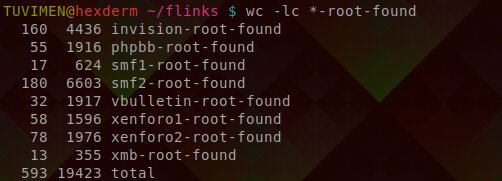

# getall

Discovers a list of root urls of forum engines by scraping [builtwith](https://builtwith.com/).

Is a wrapper script calling `builtwith` for all forum engines and processing links with `forumscraper-findroot`.

It should be called from the same directory where other scripts are saved, so for this case

```bash
cd discover
./getall
```



The script outputs 593 links for me, some of them might not really be correct root links but at least 96% of them is.

This script runs for over 2 hours as most of the sites on `builtwith` doesn't exist anymore, but to make sure of it script retries connections, so all time is spend on waiting.

To underline the amount of bad links - in the first stage `builtwith` found 1819 links and `forumscraper-findroot` found roots for only 593 of them.

Found links can be used to download whole forums.

# builtwith

A simple scraper that recursively gets free samples of sites given to unregistered users. It first goes through the main page and then sub pages for countries, continents etc.

# forumscraper-findroot

Identifies engines from a list of links from file and then finds the root of them. All of that is done repeatedly to ensure absolute correctness.

It creates a lot of files but correct links are stored in files with names ending with `-root-found`.

If you want things to go faster you can edit the declared variables on top of the script, their names are self descriptive.
